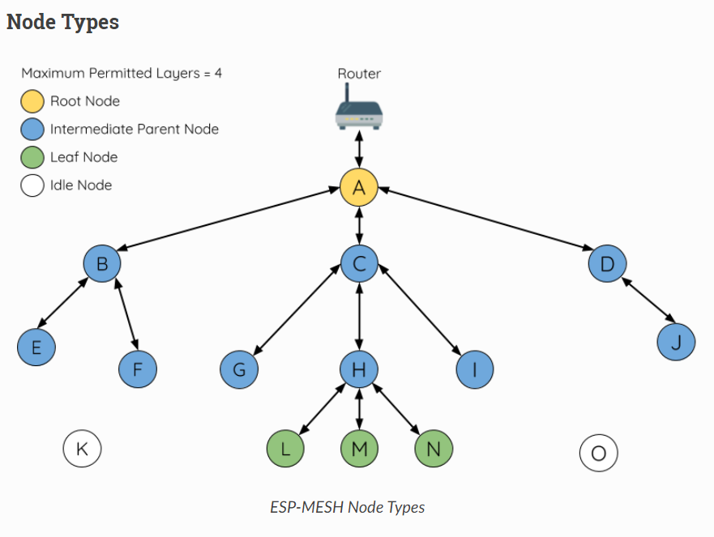
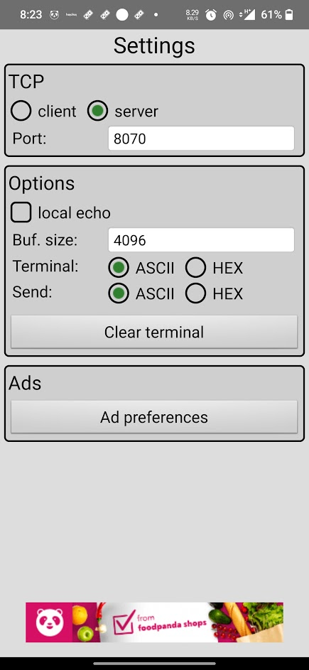
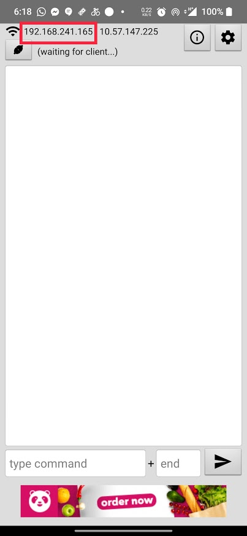
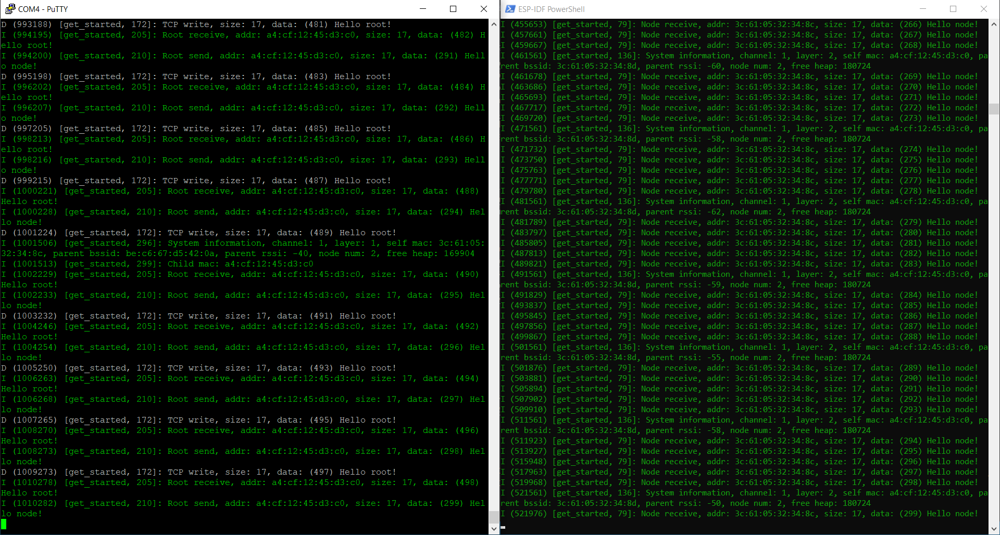
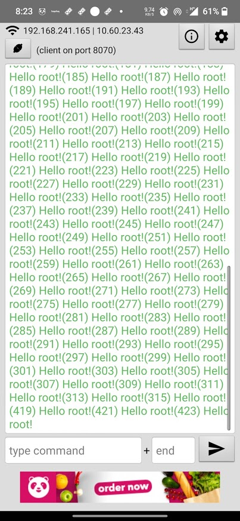

# ESP_MESH_TCP
This example demonstates how to use ESP-MDF framework for transferring data from non-root node to tcp socket. 
1. Only root node is connected to wifi router/mobile hotspot here 
2. The non-root nodes send data to root node 
3. The root-device forward their data to TCP socket



Needed componensts:
1. At least two ESP32 boards(dev-kitc used here) 
2. One mobile hotspot
3. [TCP Terminal](https://play.google.com/store/apps/details?id=com.hardcodedjoy.tcpterminal) app from play store

## Overview

This example has necessary intructions and resources to build a ESP32 wifi mesh network.This document has the intructions on how to use [ESP-MDF](https://github.com/espressif/esp-mdf.git) and install necessary toolchain for [ESP-IDF](https://github.com/espressif/esp-idf.git). 


### Quick Start

Most of the instructions are taken from ESP-MDF README.md and also some instructons and screenshots from the example MESH network are provided.

This section provides the steps for quick start with your development of ESP-MDF applications. For more details, please refer to [ESP-IDF Get Started](https://docs.espressif.com/projects/esp-idf/en/v4.0.1/get-started/index.html#get-started).

The directory ``~/esp`` will be used further to install the compiling toolchain, ESP-MDF and demo programs. You can use another directory, but make sure to modify the commands accordingly.

1. **Get ESP-IDF**:[**Setup Toolchain**](https://docs.espressif.com/projects/esp-idf/en/stable/get-started-cmake/index.html#step-1-set-up-the-toolchain): please set up according to your PC's operating system ([Windows](https://docs.espressif.com/projects/esp-idf/en/stable/get-started-cmake/windows-setup.html), [Linux](https://docs.espressif.com/projects/esp-idf/en/stable/get-started-cmake/linux-setup.html) or [Mac OS](https://docs.espressif.com/projects/esp-idf/en/stable/get-started-cmake/macos-setup.html)). 
Here esp-idf release/v4.2 is used. For windows this is the link for installer: [ESP_IDF_TOOLCHAIN_INSTALLER](https://dl.espressif.com/dl/esp-idf-tools-setup-online-2.5.exe). The example was tested in ESP-IDF Powershell.


1. **Get ESP-MDF**:

    ```shell
    git clone --recursive https://github.com/espressif/esp-mdf.git
    ```

    If you clone without the `--recursive` option, please navigate to the esp-mdf directory and run the command `git submodule update --init`

    esp-mdf "master" branch as of 17/04/2021 is used for this example.


1. **Set up ESP-MDF Path**: Toolchain uses the environment variable ``MDF_PATH`` to access ESP-MDF. The setup of this variable is similar to that of the variable ``IDF_PATH``. Please refer to [`Add IDF_PATH & idf.py PATH to User Profile`](https://docs.espressif.com/projects/esp-idf/en/v4.0.1/get-started/index.html#step-4-set-up-the-environment-variables). If you use linux, you can use this commands.

    ```shell
    cd ~/esp/esp-mdf
    source export.sh
    ```
1. [**Monitor/Debugging**](https://docs.espressif.com/projects/esp-idf/en/stable/get-started/idf-monitor.html): If you want to exit the monitor, please use the shortcut key ``Ctrl+]``.

    ```shell
    idf.py monitor
    ```

1. **Update ESP-MDF**:

    ```shell
    cd ~/esp/esp-mdf
    git pull
    git submodule update --init --recursive
    ```
1. **Creating TCP server**
Create mobile hotspot with "WPA2-Personal" security and disable "turn off hotspot automatically" option. 
Now open TCP ternimal and start tcp server as shown in the below screenshots.




After succesful tcp server setup take note of the IP address shown in the top left of the TCP Terminal app. This IP will be provided to root node via menuconfig. 

1. **Flash root and non-root node**
Please follow the instructions provided in root [README.md](https://github.com/sumit612/esp_mesh_tcp/blob/dev/root/README.md) and non-root [README.md](https://github.com/sumit612/esp_mesh_tcp/blob/dev/non_root/README.md). 
Please take note that in the mesh network topoligy used in this example can have only one root node and multiple non-root node. If everything is okay then ESP32 root and non-root will send below data through UART respectively.


The data shown in TCP Terminal are actually from non-root node.


The points below have been directly put from ESP-MDF [README.md](https://github.com/espressif/esp-mdf/blob/master/README.md) as they seemed informative. 

## ESP-WIFI-MESH Highlights

* **Easy setup**: ESP-WIFI-MESH expands the original Wi-Fi hotspot range to the reach of the most distant node in the mesh cloud. Such a network is automatically formed, self-healing and self-organizing. It saves the efforts of laying cables. All you need to do is configure the router password.

* **Gateway free**: The decentralized structure of ESP-WIFI-MESH with the absence of a gateway precludes the overall network breakdown if one single node fails. Even if there is a single ESP-WIFI-MESH device, the network still works as usual.

* **Safer transmission**: Both the data link layer and the application layer can be encrypted.

* **More reliable transmission**: The transmission and data flow control between two devices are more reliable. Also, unicast, multicast and broadcast transmissions are supported.

* **Large network capacity**: ESP-WIFI-MESH takes the form of a tree topology, so one single device can connect to 10 devices at maximum, and an entire network can have over 1,000 nodes.

* **Wider transmission coverage**: The transmission distance between two devices is 30 m through walls, and 200 m without any obstacles in between (relevant to ESP32-DevKitC).
    * **Smart Home**: Even if there are only three to five devices in your home, they can form a network and communicate with one another through walls.
    * **Street light**: If ESP-WIFI-MESH is used for the street lighting scenario, two long-distance devices can communicate with each other.

* **High transmission speed**: For Wi-Fi transmission, the speed can reach up to 10 Mbps.
    * **Environment Control System**: Directly transfers the raw data collected by sensors and analyzes mass data for calibration of algorithms, thereby improving sensors' accuracy.
    * **Background Music System**: Both audio and video transmissions are supported.
    
* **Simultaneously run Wi-Fi and BLE protocol stacks**: ESP32 chips can run both Wi-Fi and BLE protocol stacks side by side and use ESP-WIFI-MESH as the main network to transmit data, receive BLE probe beacon, send BLE broadcasts and connect BLE devices.
    * **Items tracing**: Monitors the BLE or Wi-Fi data packets from a device at multiple selected spots.
    * **Pedestrian counting**: Through monitoring Wi-Fi probe request frames.
    * **Indoor positioning**: Each device functions as a Beacon AP, continuously sending Bluetooth signal to the surroundings. The network can analyze a device's signal intensity and calculate its current position.
    * **Product promotion**: Sends real-time product information and promotions through iBeacon.
    * **Bluetooth gateway**: With each device serving as a Bluetooth gateway, traditional Bluetooth devices can also be connected to an ESP-WIFI-MESH network.

## Related Documentation

* For ESP-MDF related documents, please go to [ESP-MDF Programming Guide](https://docs.espressif.com/projects/esp-mdf/en/latest/?badge=latest).
* [ESP-WIFI-MESH](https://docs.espressif.com/projects/esp-idf/en/stable/api-guides/mesh.html) is the basic wireless communication protocol for ESP-MDF.
* [ESP-IDF Programming Guide](https://docs.espressif.com/projects/esp-idf/en/stable/) describes Espressif's IoT development framework.
* To report a bug or request a function, please go to [Issues](https://github.com/espressif/esp-mdf/issues) on GitHub to submit them. Before submitting an issue, please check if it has already been covered.
* If you want to contribute ESP-MDF related codes, please refer to [Code Contribution Guide](docs/en/contribute/index.rst).
* To visit ESP32 official forum, please go to [ESP32 BBS](https://esp32.com/).
* For the hardware documents related to ESP32-MeshKit, please visit [Espressif Website](https://www.espressif.com/en/support/download/documents).

