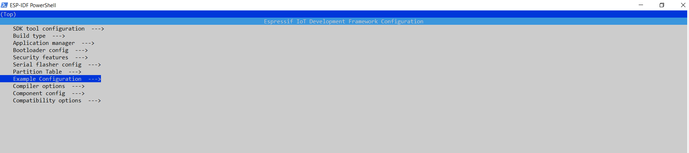
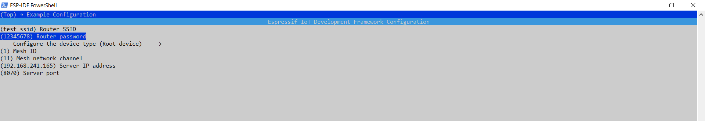

# ROOT DEVICE

## Introduction

It introduces a quick way to build an ESP-WIFI-MESH network without a router. For another detailed network configuration method, please refer to [examples/function_demo/mwifi](../function_demo/mwifi/README.md). Before running the example, please read the documents [README](../../README_en.md) and [ESP-WIFI-MESH](https://docs.espressif.com/projects/esp-idf/en/stable/api-guides/mesh.html).

Non-root node: Include leaf nodes and intermediate nodes, which automatically select their parent nodes according to the network conditions.

## Configure

To run this example, you need at least two development boards, one configured as a root node, and the other a non-root node. In this example, all the devices are non-root nodes by default.

You need to go to the submenu `Example Configuration` and configure one device as a root node, and the others as non-root nodes with `make menuconfig`(Make) or `idf.py menuconfig`(CMake).

1. **Openning terminal**
In windows ESP-IDF Powershell or ESP-IDF Command Prompt are easy way to build esp-mdf programs as they adds paths automatically at start-up.

1. **Start a Project**: The word *project* refers to the communication example between two ESP-WIFI-MESH devices.
if the current working directory in Powershell is the clonned directory that means in "esp_mesh_tcp\" then follow the instructions.

    ```shell
    cd  .\root\
    ```

1. **Build and Flash**: For the rest, just keep the default configuration untouched.

    ```shell
    idf.py menuconfig
    idf.py -p [port] -b [baudrate] erase_flash flash
    ```




You can also go to the submenu `Component config -> MDF Mwifi`, and configure the ESP-WIFI-MESH related parameters like max number of layers, the number of the connected devices on each layer, the broadcast interval, etc.


